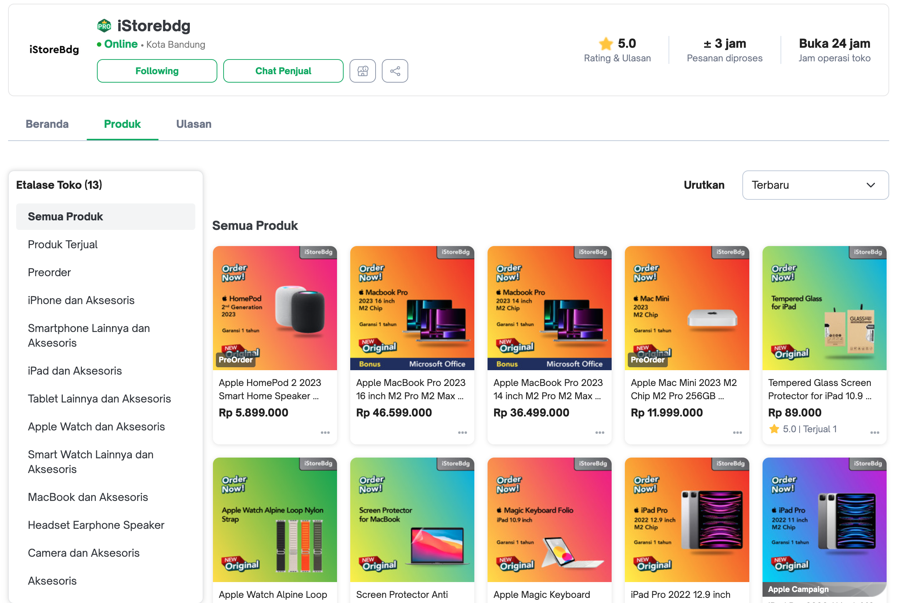
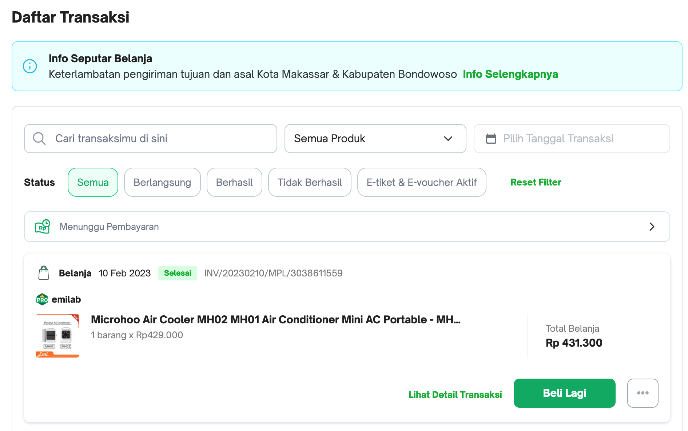

# Pre-Bootcamp db engineer test

Berikut adalah soal/pertanyaan yang perlu dijawab oleh peserta bootcamp

## knowledge base

1. Apa yang temen-temen ketahui tentang Database?
2. Apa bedanya antara Database dengan Files?
3. Apa yang temen-temen ketahui tentang Database Relational Management System (RDBMS)?
4. Apakah temen-temen pernah menggunakan database design? menggunakan methode apa?
5. Apakah temen-temen pernah melakukan configurasi database? seperti Cluster, High Available, Fail-Over or Single cluster jika pernah sebetukan dan menggunakan teknology apa?

Cara pengerjaan, silahkan update file ini tulis jawabanya di bawah ini

## Design & Implementation

Dalam suatu schenario ada requirement membuat aplikasi e-commerse seperti Tokopedia untuk module Catalog, Order dan Checkout seperti berikut:

1. Catalog, pelanggan mencari product di toko
    
2. Item, bisa melihat detail informasi produk
    
3. Cart, pelanggan bisa menambahkan produk yang ingin di beli ke keranjang
    
4. Setelah di checkout, masuk ke list transaction
    
5. Kita juga bisa liat detail transactionya
    ![detail-transaction]

Kemudian temen-temen buat design database berdasarkan method yang temen-temen gunakan misalnya menggunakan ERD atau Object UML, 

kemudian bagaimana untuk melakukan tuningnya jika nanti pada request query harus memenuhi `1000` tps (Transactions per Second) untuk query yang compleks